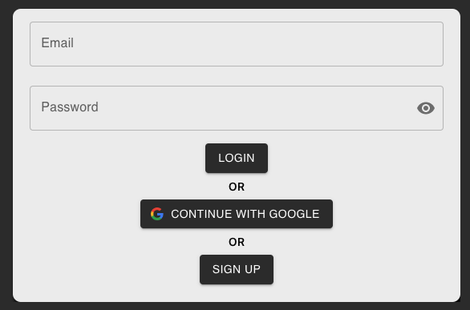
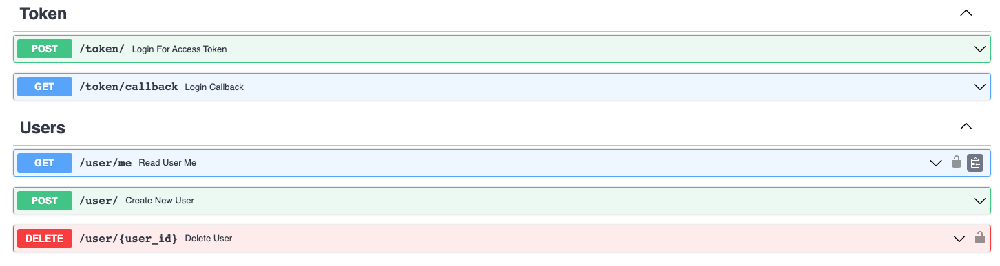

# Simple Auth0 FastAPI React Application

A simple application for user authentication & authorization (JWT based) and user management based on Auth0 service. Backend is in Python with FastAPI, integrated with auth0 client. Frontend is vanilla react application contains simple login, signup form, and google account login.
 
This repo is for a quick start with Auth0.

## Application Features
### Client-side
- Login (username and password)
- Signup (username and password)
- Google account login

### Server-side
- JWT verification
- Private endpoint example (must have access token to get access)
- Scoped-private endpoint example (must have access token and permissions to get access)

## Services Setup
### Backend
Go to `services/backend/README.md`

### Frontend
Go to `services/frontend/README.md`

### Auth0
Go to `services/auth0/README.md`

## Open Tasks
- A script for auto create Auth0 environment given Auth0 Management credentials only 
- Add deployment (docker-compose ? )
## Contributing

Pull requests are welcome. For major changes, please open an issue first
to discuss what you would like to change.

Please make sure to update tests as appropriate.

## License

[MIT](https://choosealicense.com/licenses/mit/)
